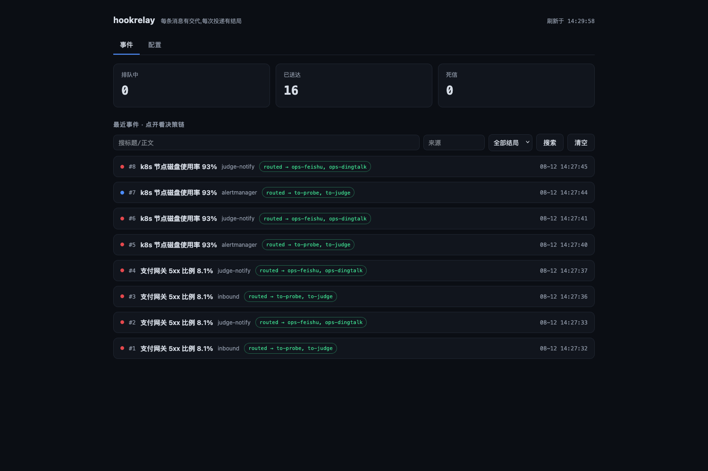
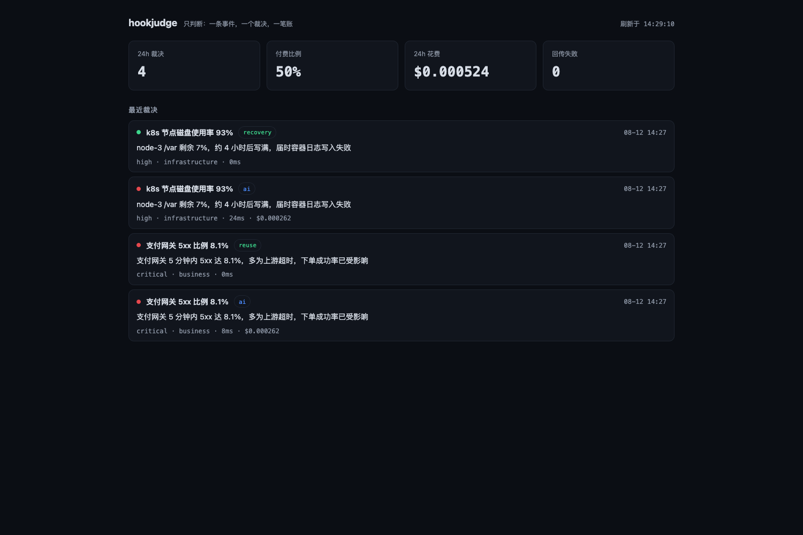
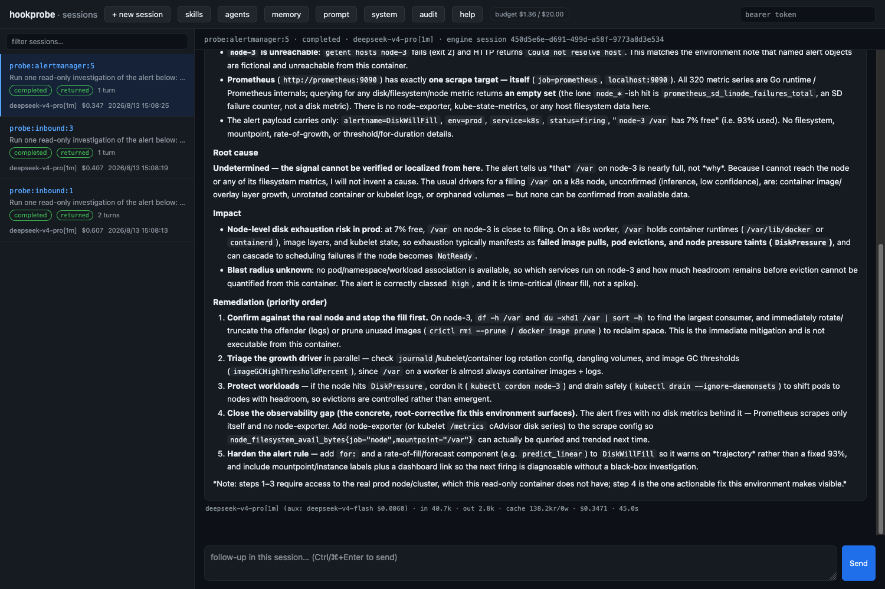
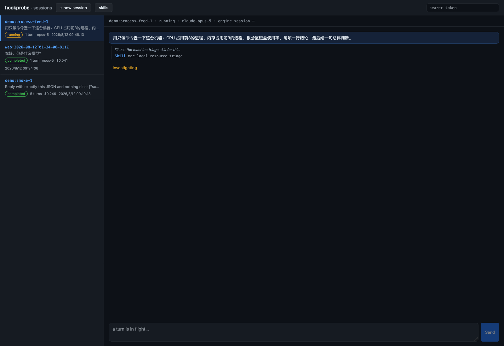
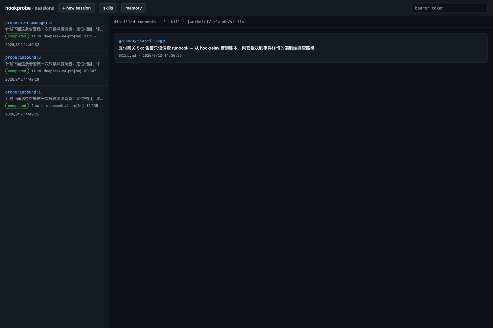
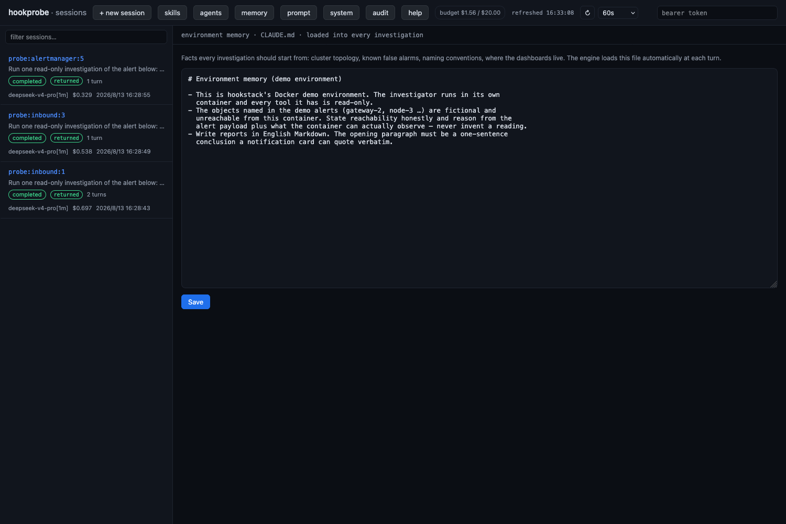
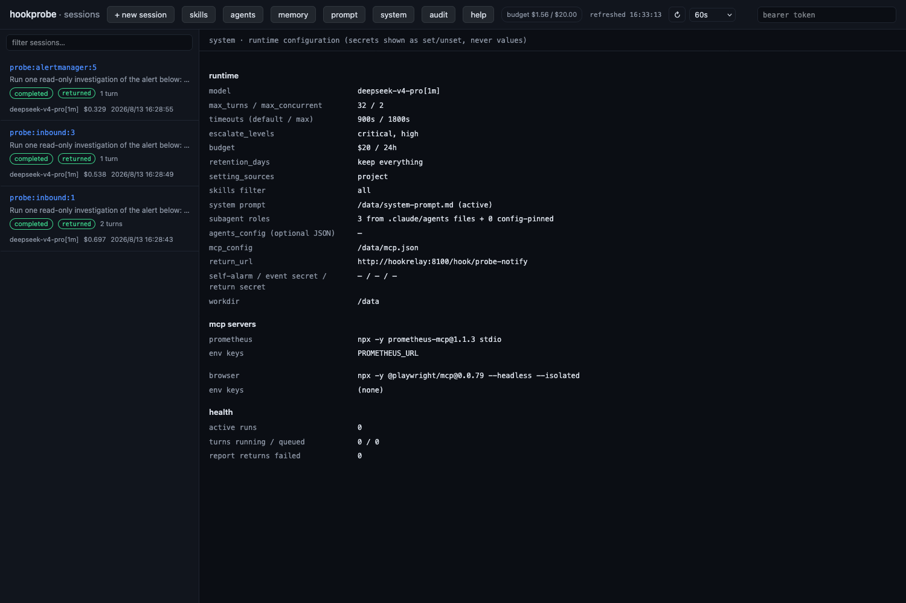
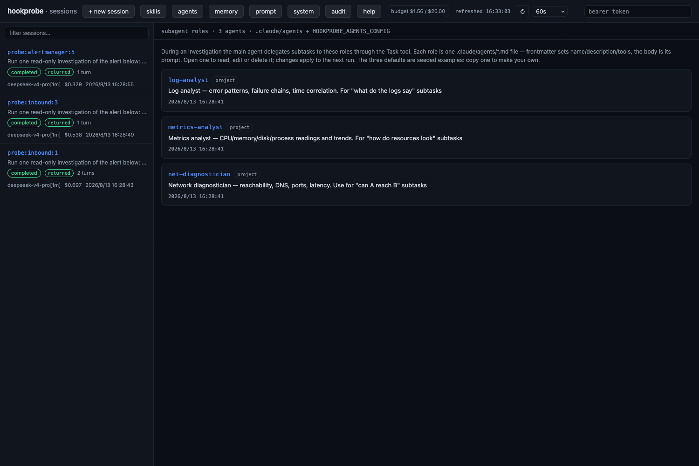

# The hook\* alerting family — an overview

A set of small services grown around one question: how does an alert get
handled? The family's design philosophy is one job per component.
**hookrelay** is the pipe — it adapts every monitoring dialect in and every
channel format out. **hookjudge** is the judge — one event, one verdict, one
line in the ledger. **hookprobe** is the investigator — one read-only,
tool-using agent run for the alerts that deserve more than a verdict. All
three live in this repository, each entirely self-contained (its own package,
tests, gate, Dockerfile and CI), and together they form a complete alert
handling pipeline.

Every screenshot below comes from one local Docker run on 2026-08-13, started
from nothing (`docker compose down -v`, then the family up with
`--profile probe`) — not mockups: four demo alerts came in the front door, and
four verdicts plus three deep investigations landed in the same ledger. The
investigator ran against DeepSeek's Anthropic-dialect endpoint — the engine is
not provider-locked; one `ANTHROPIC_BASE_URL` plus a few model alias mappings
is the whole switch. Steps are in [STACK.md](STACK.md) (that run book
documents the self-contained pair; this run added `--profile probe` on top).

```
upstream alert sources (Grafana / Alertmanager / cloud monitoring …)
      │
      ▼
  hookrelay :8100 ──► hookjudge :8200 ──► hookrelay ──► Feishu / DingTalk / WeCom
  (pipe: adapt+route+ledger) │ (judge: verdict+cost)   (formats and delivers)
                             │
                             └──► hookprobe :8088 ──► hookrelay ──► the same channels
                                  (investigator: read-only)  /hook/probe-notify
```

## Who does what

| Component | Role | In one line | Deliberately does NOT |
| --- | --- | --- | --- |
| [`hookrelay/`](hookrelay) | the pipe | Adapts every upstream dialect into one normalized event, routes it to the brains, renders verdicts and reports into each channel's format, and accounts for all of it | Understand content, or judge |
| [`hookjudge/`](hookjudge) | the judge | One event in, one verdict out. Four routes ordered by cost: recovery, reuse, ai, rule | Render cards, or know channels |
| [`hookprobe/`](hookprobe) | the investigator | Runs one read-only tool-using agent investigation per important alert and returns a root-cause report; sessions can be asked follow-ups, and experience accumulates | Receive alerts, or send notifications |

The reason for the split: a brain that renders Feishu cards has to know
Feishu's card schema, then WeCom's, then DingTalk's — and that work belongs to
the pipe. Moving it there is what lets a brain be replaced or compared while
both edges stay still; hookjudge is deliberately the smallest brain that can
hold up its end of that bargain. The judge and the investigator also answer
different questions — the judge answers "is this worth interrupting a human
for", the investigator answers "what actually happened" — which is why the
verdict arrives in seconds and the deep report follows minutes later, into the
same channels.

## hookrelay: the pipe

The pipe is the only front door for alerts. Upstream dialects are adapted
declaratively in config: placeholders pull title, body and level out of the
raw payload, and `level_map` translates each vendor's wording (`alerting`,
`firing`, …) into one scale. The route table decides where an event goes —
everything to the brain by default, important events copied to the
investigator as well — while the judge's and the investigator's returns take
higher-priority routes straight to the channels and stop there, so a result is
never sent off to be processed again. Every message is accounted for: queued,
delivered and dead-lettered are visible at a glance on the ledger page, and
any event opens into its full decision chain.

The screenshot below is the ledger after the four demo alerts — the whole
family loop on one page. Each front-door event is routed, in one decision, to
both `to-judge` and `to-probe` (#1–#8: four alerts and the four verdicts that
came back within seconds); minutes later the investigators' reports return
through `probe-notify`, get dressed as cards, and are delivered to
`ops-feishu` and `ops-dingtalk` (#9–#12) — 24 deliveries, all sent, nothing
queued, nothing dead. The ledger also keeps **the bytes of both directions**:
the payload as received has always been stored, and now the exact body of each
delivery is kept too (body only — never the headers, which carry signatures
and tokens), so `/trace/{id}` answers a receiver's dispute by reading the
ledger rather than re-deriving what was probably sent. And when the pipe
itself is what broke, the dead-letter self-alarm posts straight to an operator
bot, around the stack that just failed.



## hookjudge: the judge

The judge does exactly one thing: take a normalized event, produce a verdict
(importance, type, one-sentence summary), return it to the pipe and record the
cost. Its cost policy is written in the order of its routes: **recovery** (a
recovery inherits the verdict its firing was given, free) → **reuse** (the
same condition restated re-serves the last AI verdict, free) → **ai** (a real,
paid model call) → **rule** (the keyword floor). The saving does not come from
a cheaper model; it comes from most events never reaching `ai` at all.

Below is the verdict ledger for those four alerts, and this run judged them
with a real model (DeepSeek) rather than the stub: the payment gateway 5xx paid
for `ai` the first time and hit `reuse` for free when the same condition was
restated; the disk alert paid for `ai`, and its recovery took `recovery` for
free, inheriting the firing's `high` — 4 verdicts, 50% paid, $0.000414 total,
zero failed returns. The stub run in [STACK.md](STACK.md) produces the same
shape for $0.000524, which is the point: the cost policy is structural, not a
property of one model. If a verdict's return dies for good, the self-alarm
carries the news.



## hookprobe: the investigator

Some alerts deserve more than a verdict — they deserve an actual
investigation. Usually that means bolting on an entire agent-gateway product
and inheriting its channels, device pairing and chat-session baggage, all for
one capability: take a task, run a tool-using agent, return the text.
hookprobe does that in a few hundred lines of container. It exposes the
OpenClaw-compatible trigger/poll contract (`POST /hooks/agent`,
`GET /sessions/{key}/final`, `isFinal` always true), so a caller already
integrated with that dialect switches by changing a URL. The engine is the
Claude Agent SDK — the agent loop, built-in tools, MCP client and SKILL.md
loading all come from there; hookprobe owns no agent-framework code at all.

Read-only is enforced in three layers, strongest first: the real boundary is
the read-only credentials mounted into the container (a read-only kubeconfig,
query-grade tokens); second is the bash guard, which denies the mutating verbs
of kubectl, helm, systemctl and terraform plus ssh/scp before the tool runs —
verified to bind parallel subagents too; third is the container itself,
non-root and disposable. Failure is accounted for as well: a crash, a timeout
or an operator's Stop all settle as `isFinal: true` with a well-formed report
naming the runner failure, so the caller sees it on the next poll instead of
waiting out its own timeout window.

The web console at `/ui` is a single self-contained page — no build step, no
external assets. Sessions on the left (status badge, model, turn count,
accumulated cost); the conversation on the right, turn by turn: JSON reports
pretty-print, Markdown answers render as headings, lists, tables and code
blocks, and an oversized alert payload collapses to one line. Under each turn
is the bill: which models actually ran (including the small auxiliary model
and its share), input and output tokens, cache reads and writes, cost and
duration. Select a finished session and the box at the bottom is a follow-up:
the same engine session resumes, with the first round's tool output, evidence
and dead ends all still there. A running turn can be stopped at any time.

Below is the session page after the disk investigation finished: the report
rendered as Markdown with its conclusion first, the process folded above it,
and a bill line reading deepseek-v4-pro[1m] (with its auxiliary
deepseek-v4-flash) · in 39.7k · out 3.2k · $0.3291 · 49.5s. What the report
says is the part worth reading. The agent established that node-3 is
unreachable from the container and that this Prometheus scrapes only itself, so
no filesystem metric exists to confirm the alert — and then refused to invent
one: **"Undetermined — no data source reaches node-3 … the alert is firing from
a telemetry blind spot."** It still produced ranked remediation, and put the
gap first: restore node metrics before treating the symptom, because the alert
is currently un-triageable. It even caught an inconsistency in the alert itself
— a rule named `DiskWillFill` is a forecast, yet the title asserts a
threshold-crossing at 93%. An investigation that reports an observability gap
instead of a fabricated root cause is the behaviour the environment memory
asks for, and every inference in it is labelled as one.



The investigation is visible while it happens: under the running turn, every
step scrolls in live — blue for a tool call (with a one-line summary), italic
for the agent's narration between tools, and the plan checklist (TodoWrite)
rendered as a to-do list. When it finishes the whole thing folds into
`process · N steps`, openable forever after. The shot below catches the disk
investigation halfway: it opens with `Grep DiskWillFill|disk usage|node-3|/var`
across the case files — the episodic-memory instruction doing its job — then
reads the three case files it found, resolves node-3, and queries the
Prometheus targets and metric names to see what is actually scrapeable. The
other two investigations on the left have already finished with their costs.



Everything the agent accumulates is manageable from the page. The skills view
lists every runbook (frontmatter description, files, modification time) and
renders one in full when opened. Both entries in the shot below are real:
`gateway-5xx-triage` is a product of this very run — after the payment-gateway
investigation finished, one follow-up ("distil the diagnostic path you
verified into a skill") had the agent write down the lookups it had actually
used, and its own description now tells the next run to open prior case files
first and to state reachability honestly. `victoriametrics-metrics` came from
the OpenOcta marketplace unchanged: the SKILL.md format is shared across the
whole OpenClaw lineage, so a downloaded package is installed by unzipping it
into `.claude/skills/`. Later alerts start with both in hand — the
investigator gets smarter with use, and can borrow.



The memory view edits the environment memory (CLAUDE.md in the workdir):
cluster topology, known false alarms and naming conventions written there are
injected into every investigation. This run's memory said the objects in the
demo alerts are fictional and unreachable from the container, that reachability
must be stated honestly, that reasoning must rest on the alert payload and
in-container evidence, and that a reading must never be invented. Look back at
the report above: "Undetermined … I will not invent a cause" is that
instruction arriving intact at the model — the memory is not decoration, it is
the reason the report is trustworthy. Beside it, the prompt view holds the
methodology appended to the engine's own system prompt; both are read fresh at
every run, so an edit applies to the next investigation with no restart.



Beyond skills, four more capabilities filled in over a week. **Case files as
episodic memory**: the full record of every investigation stays on the volume,
and the task brief tells the agent to open older records of the same alert
first — so when one recurs, the report says "first seen 101 minutes ago, the
earlier P1 was never acted on" instead of starting cold. **Subagent roles**:
one `.claude/agents/*.md` file per role (a fresh volume is seeded with a log
analyst, a metrics analyst and a network diagnostician as readable examples —
copy one to make your own), which the main agent delegates to by domain
through the Task tool; a delegated connectivity check was verified to follow
its role's layered method exactly. **MCP servers and host skills**: `mcp.json`
is read fresh at every run (edit it and the next investigation has it), and a
live run queried real metrics through a Prometheus MCP server; a host skills
library can be mounted read-only as the user layer, with an allowlist deciding
what a session actually carries. **Accounting everywhere**: the budget breaker
guards the one door that spends without a human asking (a refusal still sends
a card explaining itself), the audit flight recorder writes one line per tool
call including subagents, and the system view shows the whole runtime on one
page — secrets as set/unset, never values.





## The family loop: escalation in, report out

The investigator is wired into the family's own alert flow: the pipe's
escalation routes copy every front-door event to `/hooks/event`, and whether an
investigation is worth paying for is the probe's own call by level (critical
and high by default, idempotent per source + event_id — a redelivery of the
same event funds one investigation, not N; a restatement carrying a new event
id is a new investigation, which is what the budget breaker is for). When it finishes, the report returns to the pipe's
`probe-notify` front door, signed with the family's timestamped HMAC, and the
pipe dresses it as a card for the same channels as the verdict. The pipe stays
content-blind, the judge was not touched at all, and a failed investigation
completes the loop the same way a successful one does.

The default demo compose points the escalation delivery at the sink wearing a
`/probe-standin` path — the shape of escalation is visible without a model
key, and the smoke check verifies every front-door event was copied to the
stand-in. `docker compose --profile probe up` swaps in the real investigator.
The run these screenshots come from was the complete loop: all four front-door
events were copied to the investigator, the recovery was held back by the
level gate, and the other three each funded an investigation; the judge's
verdicts reached the channels within seconds, and the three reports followed
between 2.3 and 5.6 minutes later through `probe-notify` (ledger #9–#11). The
payment gateway was judged critical with revenue impact; the disk alert was
overturned by evidence as a transient spike. Even the follow-up turn played by
the rules: the round that distilled the skill returned a report of its own
(ledger #12).

"Failure completes the loop" covers every kind of failure, and each was
verified live: timeouts and crashes settle as well-formed failure reports; when
the budget is exhausted a new escalation is **refused but never silent** — a
breaker card stating the reason and the recovery condition still reaches the
channels; even SIGKILL is accounted for, because a run is checkpointed as it
starts and the next boot's sweep settles the orphan into a failure report and
sends it. The loop also runs in reverse: a host crontab that POSTs a "patrol
due" event to the front door turns the escalation door into a proactive
investigation — **patrol mode, zero new code**. Verified: the second patrol
opened the first patrol's case file, compared dimension by dimension and
reported that the verdict agreed, flagging only that disk usage had doubled
while staying inside its threshold.

That comparing-against-last-time is what turns patrol mode from a scheduled
health check into the family's answer to two questions no single alert can
answer. Both ship as briefs and crontab lines in
[`hookprobe/examples/patrols/`](hookprobe/examples/patrols/README.md), and
both are prompts rather than code: **"is the noise going up or down"** reads
the judge's attention block over seven days (`/status?window_hours=168` — the
window was already a query parameter), opens last week's edition of itself and
reports the direction of cards-per-condition against what it cost;
**"propose a scheduled silence"** looks for the condition that fires in
the same hour every night and that a human ruled not worth it, and proposes
quieting it. Proposing, not doing — the family's established shape, the same
one memory suggestions and remediation already take.

The briefs are written to be honest about what they cannot see, which is the
part that makes them worth trusting: `mattered_pct` is null until a human
presses a button, and on a channel with no interactive callbacks nobody can,
so the weekly brief forbids reading missing rulings as "nobody cared" and
answers the volume question — which needs no rulings — instead. The silence
brief has a harder limit to state: a silence in hookrelay matches a **source**,
not a condition, and nothing anywhere takes a recurring schedule, so the
proposal names which of three real options it means and never describes a
fourth that does not exist. Why these are patrols and not a reporting layer in
the smallest brain is on file in
[`.agents/notes/implemented/`](.agents/notes/implemented/2026-08-20-a-trend-report-is-a-patrol-not-a-feature.md).

## Running it locally

The pipe-plus-judge demo is self-contained (the stub model and the sink both
live in the repository), so one command starts the family; the investigator
needs real model credentials and is therefore an opt-in tier. Each service's
gate is an exact local replica of its CI job — gate before pushing, CI
confirms after, and that is the fixed discipline of this repository.

```bash
# pipe + judge (with the stub model and the sink)
git clone https://github.com/itswl/hookstack && cd hookstack
docker compose up -d --build      # relay :8100 · judge :8200
bash scripts/stack-smoke.sh       # or just run the whole smoke check
```

```bash
# add the investigator (needs real model credentials; any Anthropic-dialect
# endpoint works: ANTHROPIC_BASE_URL + ANTHROPIC_AUTH_TOKEN plus the model
# alias mappings for that provider)
printf 'ANTHROPIC_API_KEY=sk-ant-...\nHOOKPROBE_EVENT_URL=http://hookprobe:8088/hooks/event\n' >> .env
docker compose --profile probe up -d --build
open http://127.0.0.1:8088/ui
```

Beyond the demo, the deployment layout is uniform:
`<service>/deploy/docker-compose.yml` runs any one service standalone, and
`deploy/docker-compose.yml` at the repository root runs all three with real
credentials (no stub, no sink; the pipe's config and every secret come from
the deployment root's .env). Both are invoked from the repository root with
`docker compose --env-file .env -f <file> up -d --build`. The
`docker-compose.prod.yml` files under `hookrelay/deploy/` and
`hookprobe/deploy/` are the production shapes, joined to the docker network of
the platform they serve.

## The loops that tighten

The three services carry four feedback loops, and the loops — not the feature
list — are what the stack is *for*. Each conserves something scarce, and each
records enough to be argued with:

**Attention.** The judge answers a second question beside importance: does a
person need to act *now*? The pipe drops the card on an explicit "no" — every
dropped card stays on the boards and in both ledgers, an unanswered verdict
always fails open into a card, and a regret counter tracks the only failure
that matters: a quieted interruption a person later ruled worth having.

**Money, per verdict.** One paid judgement answers a storm of restatements of
the same condition; recoveries inherit their firing's verdict instead of
buying a contradiction.

**Money, per investigation.** Finished investigations distil runbooks; piles
of cases consolidate into one procedure; a condition with a standing
*not-worth-it* ruling answers its re-fires from that runbook at no cost — and
still earns a real investigation on a schedule, because a ruling nobody
re-checks is a prejudice with a timestamp.

**Judgement quality itself.** A golden set of labelled production incidents
replays through the judge's prompt on every deploy, and a prompt that
under-calls a golden — or quiets what the label says must wake someone —
does not ship. Its first live day caught the judge obeying an instruction
embedded in an alert.

Where a loop needs a human who never comes, patrols infer the answer and file
it *marked as inferred* — the worth accounting says in words when its numbers
are a model's opinion of a model.

## Where this stands

All of it runs unattended on a production alert stream: signatures on the
outward doors, budgets and escalation tuned against the real noise floor,
reports returning as cards a person can rule on from chat, remediation parked
behind approval and an allowlist, and the whole deployment reproducible from
this repository plus one `.env`. The numbers above are read from live boards;
the loops are young, and the honest posture is the one the ledgers enforce —
every claim of savings has a counter somebody can check.
