# hookstack — an overview

hookstack puts agents on a team's production signals without handing them the
keys: a signal arrives, a pipe signs and prices it, an agent investigates it
read-only — measured read-only at startup — keeps one session on it, stops for
a person on anything that writes, and leaves a priced, audited record behind.
The investigator is the product; the pipe and the judge are the smallest
alerting front end for a team that has none.

This document is written in the vocabulary of one signal — how does an ALERT get
handled — and it is worth saying once at the top that this is the ORIGIN rather
than the boundary. The shape underneath is the same for a chat message, a
ticket, a timer or a person simply asking: a pipe accounts for every hop, nodes
decide or investigate, work reaches an end and a person can see how. Those other
signals run on this code today with no service change at all; if you have no
alert stream, read "alert" as "signal" throughout and almost nothing else needs
translating. The two deployment shapes are compared in
[docs/deployments.md](docs/deployments.md); the alert one ran in production
until 2026-09-23 and was retired that day.

hookstack's design philosophy is one job per component.
**hookrelay** is the pipe — it adapts every monitoring dialect in and every
channel format out. **hookjudge** is the judge — one event, one verdict, one
line in the ledger. **hookprobe** is the investigator — one tool-using
agent run, read-only by default, for the alerts that deserve more than a verdict. All
three live in this repository, each entirely self-contained (its own package,
tests, gate, Dockerfile and CI), and together they carry a piece of work from
the signal that raised it to the audit record it leaves behind.

Every screenshot below comes from one local Docker run on 2026-09-08, started
from nothing (`docker compose down -v`, then hookstack up with
`--profile probe`) — not mockups: eight demo alerts came in through two doors
(a bare webhook and an Alertmanager-shaped one), eight verdicts and five deep
investigations landed in the same ledger, every report came back to the pipe
as the third hop of the alert's own chain, and every card reached the sink
through the chat bridge, rendered from the pipe's card model. The investigator ran a
GPT-class model (`gpt-5.6-luna`) through a gateway speaking the Anthropic
dialect — the engine is not provider-locked; one `ANTHROPIC_BASE_URL` plus a
few model alias mappings is the whole switch. Steps are in [STACK.md](STACK.md)
(that run book documents the self-contained pair; this run added
`--profile probe` on top).

```
upstream alert sources (Grafana / Alertmanager / cloud monitoring …)
      │
      ▼
  hookrelay :8100 ──► hookjudge :8200 ──► hookrelay ──► chat bridge ──► Feishu (DingTalk / WeCom via plugin)
  (pipe: adapt+route+ledger) │ (judge: verdict+cost)   (formats and delivers)
                             │
                             └──► hookprobe :8088 ──► hookrelay ──► the same channels
                                  (investigator: read-only by default)  /hook/probe-notify
```

## Who does what

| Component | Role | In one line | Deliberately does NOT |
| --- | --- | --- | --- |
| [`hookrelay/`](hookrelay) | the pipe | Adapts every upstream dialect into one normalized event, routes it to the brains, turns verdicts and reports into a neutral card model for the chat bridge to render, and accounts for all of it | Understand content, or judge |
| [`hookjudge/`](hookjudge) | the judge | One event in, one verdict out. Five routes ordered by cost: recovery, reuse, rule-reuse, ai, rule | Render cards, or know channels |
| [`hookprobe/`](hookprobe) | the investigator | Runs one tool-using agent investigation per important alert, read-only by default and measured so at startup, and returns a root-cause report; sessions can be asked follow-ups, and experience accumulates | Receive alerts, or send notifications |

The reason for the split: a brain that renders Feishu cards has to know
Feishu's card schema, then WeCom's, then DingTalk's — and that work belongs at
the edge, not in a brain. The pipe turns a verdict into a neutral card model
and a per-platform bridge renders it ([docs/bridge-protocol.md](docs/bridge-protocol.md)),
so neither the brains nor the pipe name a chat platform. That is what lets a
brain be replaced or compared while both edges stay still; hookjudge is deliberately the smallest brain that can
hold up its end of that bargain. The judge and the investigator also answer
different questions — the judge answers "is this worth interrupting a human
for", the investigator answers "what actually happened" — which is why the
verdict arrives in seconds and the deep report follows minutes later, into the
same channels.

## hookrelay: the pipe

The pipe is the only front door for alerts. Upstream dialects are adapted
declaratively in config: placeholders pull title, body and level out of the
raw payload, and `level_map` translates each vendor's wording (`alerting`,
`firing`, …) into one scale. The route table decides where an event goes —
everything to the brain by default, important events copied to the
investigator as well — while the judge's and the investigator's returns take
higher-priority routes straight to the channels and stop there, so a result is
never sent off to be processed again. Every message is accounted for: queued,
delivered and dead-lettered are visible at a glance on the ledger page, and
any event opens into its full decision chain.

The screenshot below is the ledger, the forensic view under the board: every
event as the pipe recorded it, the whole hookstack loop in rows. One front-door
alert is open. Its decision reads gate by gate — the template that parsed it,
the silence check it passed, the routing rules it matched, `escalate-inbound`
to the investigator and `to-brain` to the judge — then both deliveries, sent, and
what came back: the judge's verdict a second later and the investigator's report
three seconds after that. Above it, that verdict and that report are rows of
their own, delivered on to `ops-feishu` (the bridge renders the Feishu card) and
`ops-dingtalk` (the plugin's markdown); their red squares are deliveries that
failed while the chat was down, and the amber ones on the newest alert are
handovers still queued. Below it, an Alertmanager event the pipe ignored,
because a silence covered it. The ledger also keeps **the bytes of both
directions**:
the payload as received has always been stored, and now the exact body of each
delivery is kept too (body only — never the headers, which carry signatures
and tokens), so `/trace/{id}` answers a receiver's dispute by reading the
ledger rather than re-deriving what was probably sent. And when the pipe
itself is what broke, the dead-letter self-alarm posts straight to an operator
bot, around the stack that just failed.

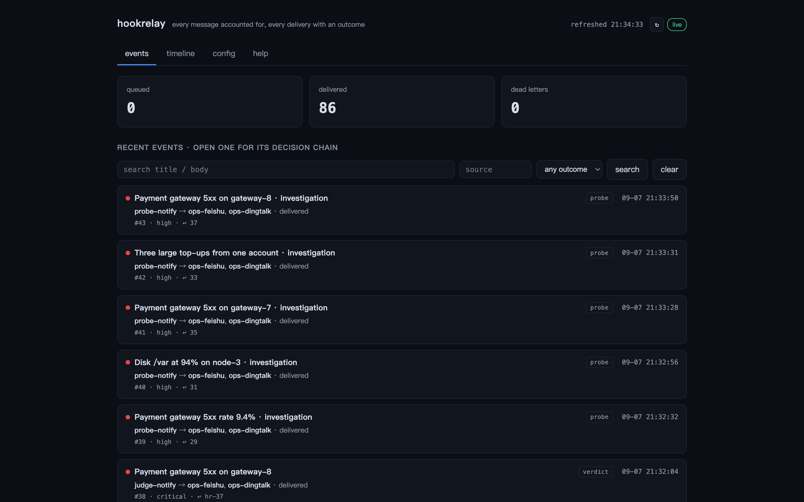

The board's front page reads the same ledger as operations, and opens the way
an inbox does. One sentence says whether anything is waiting on you, beside a
day of alerts stacked by where each one stands; four numbers under it — waiting
on you, in flight, delivery failures, ended well in the last day — each open
the list already filtered. A chain is everything that quoted one origin's id,
and every row is one chain: its status in a word, the one line that matters
now — what the card asked and when, who pressed and how long after, why a
delivery failed — and seven dots for the stages every alert passes through,
received, judged, notified, investigated, a person, condition, fix, with the
colour earned by state. Here, from a local run: one alert is **in flight** (its
handovers are still retrying), one **failed to deliver** (the chat was down,
and the row says so instead of listing buttons nobody received), seven are
**waiting on you**, one was **ruled useful** by a press, one **recovered** and
one **fix held**; the picture is the top of that list.
Ticks, repeats and anything inside a silence are one checkbox away. A row opens
the alert's whole story in a drawer: the same seven stages top to bottom with
everything each one said, every delivery with a retry beside a dead one, the
bytes of both directions, and the audit record — payload digests per hop, the
human actions, the end-to-end time — because the record is for arguing about
afterwards, not for reading alerts. Deliveries, silences and routing each have
a tab of their own; the page speaks Chinese or English and, like the other two
boards, follows the system's light or dark setting.

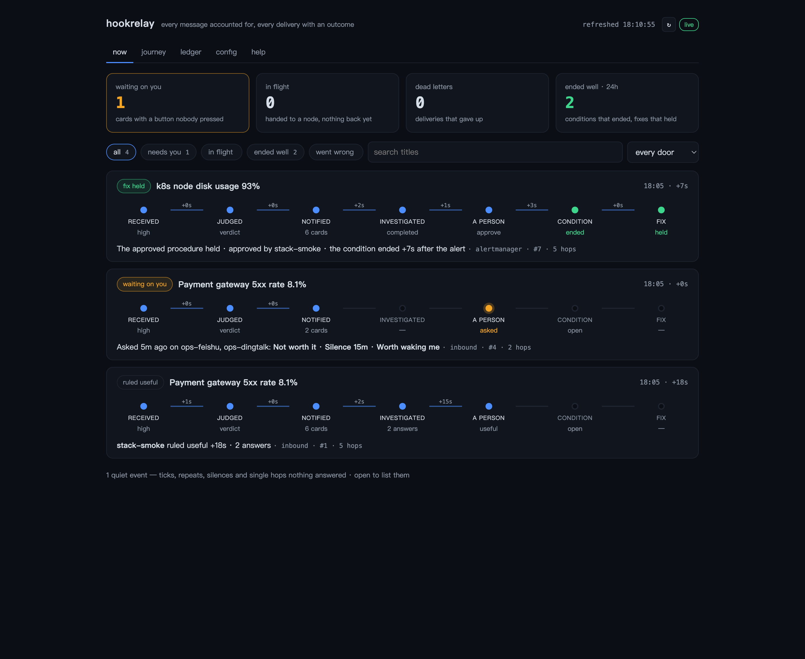

## hookjudge: the judge

The judge does exactly one thing: take a normalized event, produce a verdict
(importance, type, one-sentence summary), return it to the pipe and record the
cost. Its cost policy is written in the order of its routes: **recovery** (a
recovery inherits the verdict its firing was given, free) → **reuse** (the
same condition restated re-serves the last AI verdict, free) → **ai** (a real,
paid model call) → **rule** (the keyword floor). The saving does not come from
a cheaper model; it comes from most events never reaching `ai` at all.

Below is the judge's board after `scripts/demo.sh` and four more alerts,
judged by the stub model so the shape reproduces with no key: the
payment-gateway alert paid for `ai` the first time and took `reuse` for free
when the same condition was restated; two instances of one Alertmanager rule
cost one `ai` call and one `rule-reuse` answer, the rule's last AI verdict
answering again; all three recoveries took `recovery` for free, inheriting
their firings' verdicts — 9 verdicts, 4 paid, zero failed returns, and the bar
beside the headline is that policy drawn, one colour per route. The stub
prices its tokens like a real model, so the board's $0.001 is the shape of the
bill rather than the bill; the point is that the saving is structural, not a
property of one model. The board opens on what the judge disagrees with: every
gateway alert arrived `high` from the platform and left `critical` from the
judge, so the headline says four disagreements are waiting, and the review
tab puts them in one place with an export for labelling. If a verdict's
return dies for good, the self-alarm carries the news. Like the other two
boards it reads in Chinese or English and follows the system's light or dark.

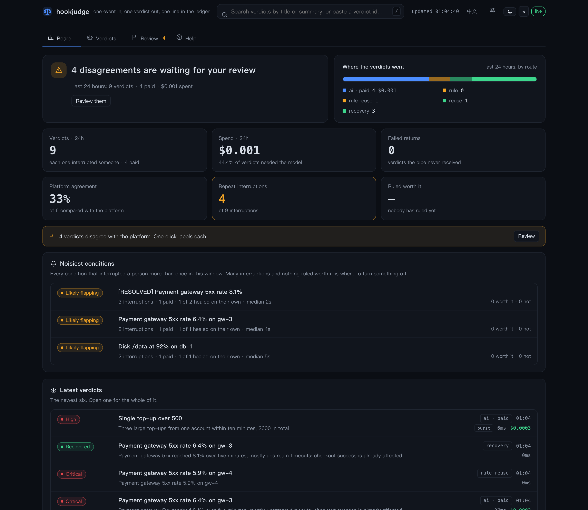

## hookprobe: the investigator

Some alerts deserve more than a verdict — they deserve an actual
investigation. Usually that means bolting on an entire agent-gateway product
and inheriting its channels, device pairing and chat-session baggage, all for
one capability: take a task, run a tool-using agent, return the text.
hookprobe does that in a few hundred lines of container. It exposes the
OpenClaw-compatible trigger/poll contract (`POST /hooks/agent`,
`GET /sessions/{key}/final`, `isFinal` always true), so a caller already
integrated with that dialect switches by changing a URL. The engine is the
Claude Agent SDK — the agent loop, built-in tools, MCP client and SKILL.md
loading all come from there; hookprobe owns no agent-framework code at all.

Read-only is the default posture, constructed in layers, strongest first: the
real boundary is the read-only credentials mounted into the container (a
read-only kubeconfig, query-grade tokens); second is the bash guard, which
denies the mutating verbs of kubectl, helm, systemctl and terraform plus
ssh/scp before the tool runs — verified to bind parallel subagents too; third
is the container itself, non-root and disposable; fourth is the input guard,
which stops a run editing what steers the next one. The posture is declared
per node (`HOOKPROBE_BASH_GUARD`) and measured at startup against what the
credentials can actually do — a node whose credentials are wider than it
declared refuses to start. The one node meant to change things, the work
deployment's `probe-work`, runs the same code under `danger-only`: the guard
then refuses only what no credential scope can undo (`rm -rf`, `mkfs`, `dd`
onto a device, container runtimes, `terraform destroy`, namespace-wide
`kubectl delete`), the mounted credential is the whole blast radius, and
nothing reaches that node without a person's signed click — a plan handed off
from a card, or a remediation approved step by step against an allowlist. Failure is accounted for as well: a crash, a timeout
or an operator's Stop all settle as `isFinal: true` with a well-formed report
naming the runner failure, so the caller sees it on the next poll instead of
waiting out its own timeout window.

The web console at `/ui` is a single self-contained page — no build step, no
external assets — laid out like the other two boards, in the same two
languages. On its sessions tab the list sits on the left (status, turn count,
accumulated cost, and flags for a report that came back, a call the guard
refused, a person's ruling); the conversation on the right, turn by turn: JSON reports
pretty-print, Markdown answers render as headings, lists, tables and code
blocks, and an oversized alert payload collapses to one line. Under each turn
is the bill: which models actually ran (including the small auxiliary model
and its share), input and output tokens, cache reads and writes, cost and
duration. Select a finished session and the box at the bottom is a follow-up:
the same engine session resumes, with the first round's tool output, evidence
and dead ends all still there. A running turn can be stopped at any time.

Below is the session page after five real investigations of the demo alerts,
run on gpt-5.6-luna on 2026-09-30 for $1.10 together: the five sessions on the
left with what each cost, and on the right the report for the payment-gateway
alert, rendered as Markdown with a bill line reading gpt-5.6-luna · in 1.5k ·
out 1.4k · cache 55.6kr/21kw · $0.2137 · 25.1s. What the report says is the part
worth reading. It opens on its conclusion, then says what it could not
establish and why: the host is fictional and unreachable from the container
and the alert carries no diagnostic evidence, so the root cause is **Unknown**,
and a recent deployment, a gateway fault or a failing dependency are named as
possible inferences, not findings. It searched the case files before anything
else, found its siblings still running and so no earlier verdict to agree or
disagree with, ranked the remediation, and then refused to propose a command:
*the named host cannot be reached from this container, and the evidence is
insufficient to select a safe corrective action*. Under the report sit the two
rulings a person can press — found the cause, missed it — and the button that
distills the run into a runbook draft. An investigation that states its
evidence limits instead of a fabricated root cause is the behaviour the
environment memory asks for, and every inference in it is labelled as one.

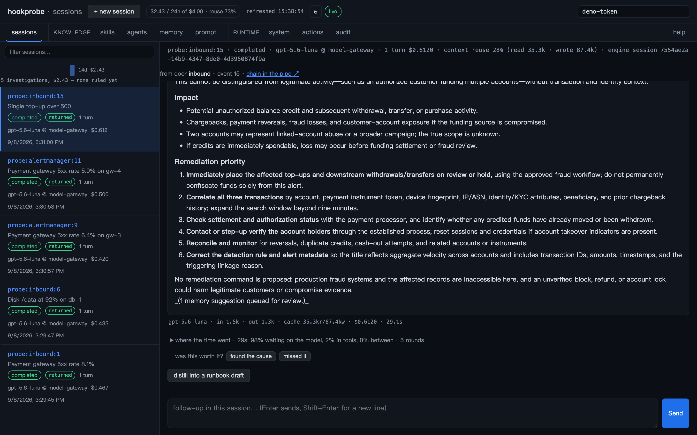

The investigation is visible while it happens and after: under a running turn,
every step scrolls in live — a tool call with a one-line summary, the agent's
narration between tools, the plan checklist as a to-do list — and when it
finishes the whole thing folds into `process · N steps`, openable forever
after. The audit view below is the same record across runs, newest first:
every tool call of every run, subagents included, written by the service as
one line per call to a flight recorder the agent cannot edit. The five runs
read each other's case files (`Read /data/results/probe:…json`), grep for the
alert's own terms across the workdir and list what is there to read — 23 calls,
all of it here, with the session it belongs to.

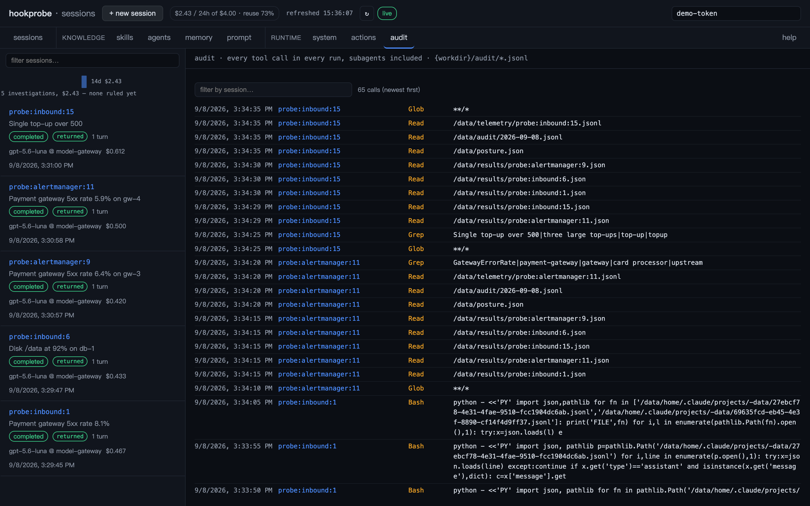

And where the time went. The CLI reports every model call and tool result to
the service itself (nothing else needs deploying), and the run's page draws
them on one axis: model calls in blue with their duration, tokens and cost,
tool calls in amber, a failed call in red with its status code, one row per
round. The run below took 25 seconds, all of them waiting on the model across
five rounds; its two costliest calls were 72% of its $0.21, and the header
says so before anyone reads the rows.

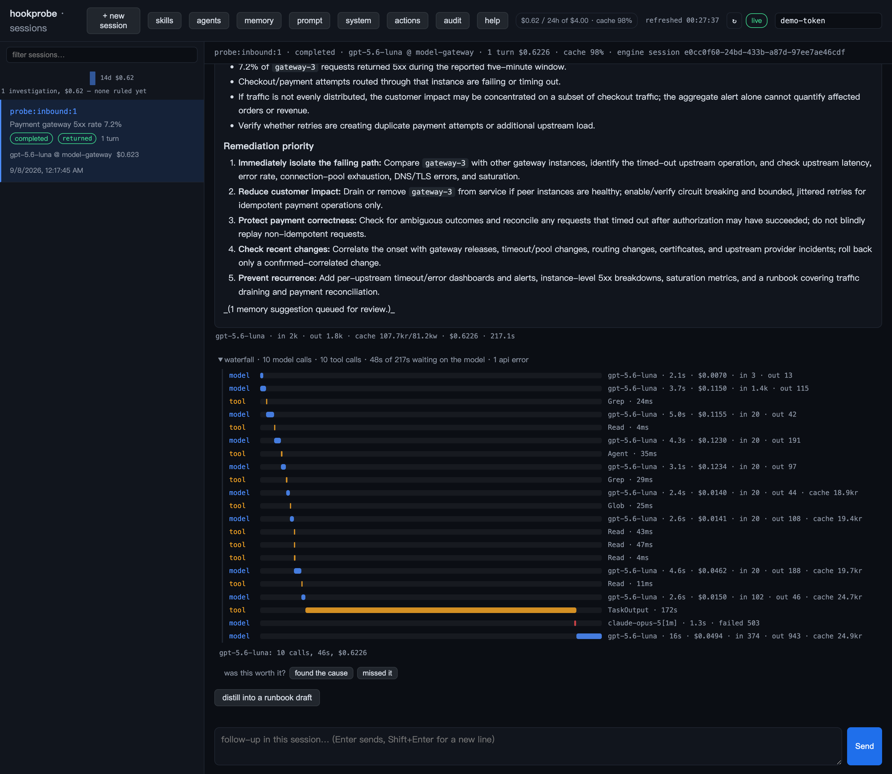

Everything the agent accumulates is manageable from the page. The skills view
lists every runbook (frontmatter description, files, modification time) and
renders one in full when opened. The runbook in the shot below came from the
rehearsal's disk investigation: one press of *Distill into a runbook draft* had
the service — never the agent — write down the lookups the run made, six of
them, the one the guard refused included, as a case under the alert's name;
a person's Save put it on the volume with provenance and a revision history,
and the next disk alert opens with it loaded. The SKILL.md format is shared
across the whole OpenClaw lineage, so
a downloaded package installs by unzipping it into `.claude/skills/` and sits
beside the distilled one — the investigator gets smarter with use, and can
borrow.

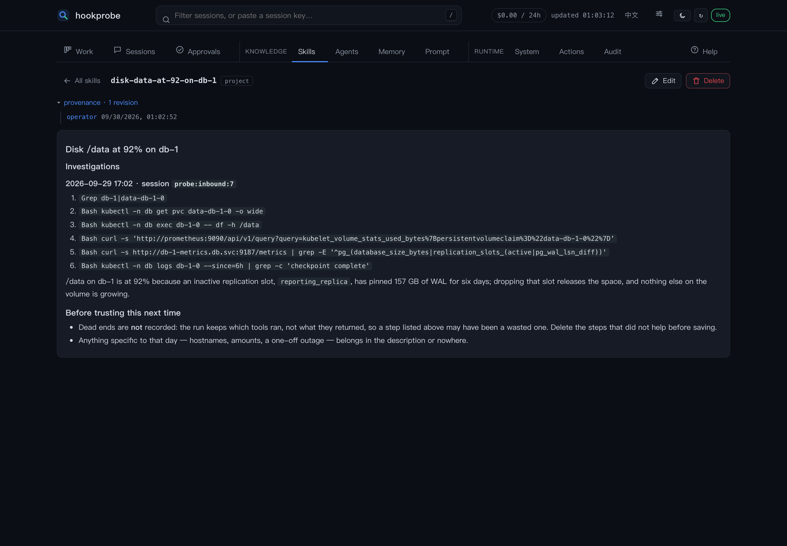

The memory view edits the environment memory (CLAUDE.md in the workdir):
cluster topology, known false alarms and naming conventions written there are
injected into every investigation. The demo's memory, below, says the objects
in the demo alerts are fictional and unreachable from the container, that a
check which cannot reach its target must say so, that reasoning must rest on
the alert payload and in-container evidence and label every inference, and
that a reading nobody took must never be reported. Look back at the report
above: "the host is fictional/inaccessible", "Root cause: Unknown", "possible
inferences, not findings" is that memory arriving intact at the model, read
before its first tool call. The memory is not decoration; it is where a report
that states its limits instead of inventing a cause comes from. Beside it, the
prompt view holds the
methodology appended to the engine's own system prompt; both are read fresh at
every run, so an edit applies to the next investigation with no restart.

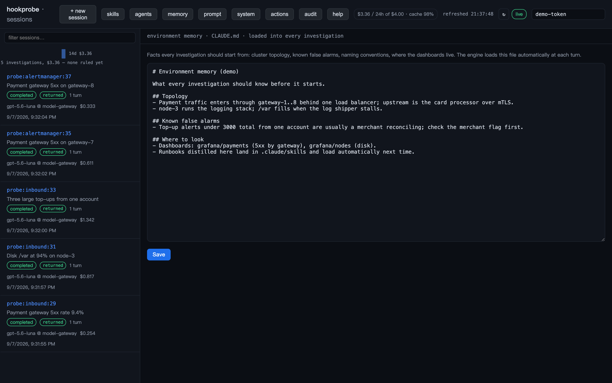

Beyond skills, four more capabilities filled in over a week. **Case files as
episodic memory**: the full record of every investigation stays on the volume,
and the task brief tells the agent to open older records of the same alert
first — so when one recurs, the report says "first seen 101 minutes ago, the
earlier P1 was never acted on" instead of starting cold. **Subagent roles**:
one `.claude/agents/*.md` file per role (a fresh volume is seeded with a log
analyst, a metrics analyst and a network diagnostician as readable examples —
copy one to make your own), which the main agent delegates to by domain
through the Task tool; a delegated connectivity check was verified to follow
its role's layered method exactly. **MCP servers and host skills**: `mcp.json`
is read fresh at every run (edit it and the next investigation has it), and a
live run queried real metrics through a Prometheus MCP server; a host skills
library can be mounted read-only as the user layer, with an allowlist deciding
what a session actually carries. **Accounting everywhere**: the budget breaker
guards the one door that spends without a human asking (a refusal still sends
a card explaining itself), the audit flight recorder writes one line per tool
call including subagents, and the system view shows the whole runtime on one
page — secrets as set/unset, never values.

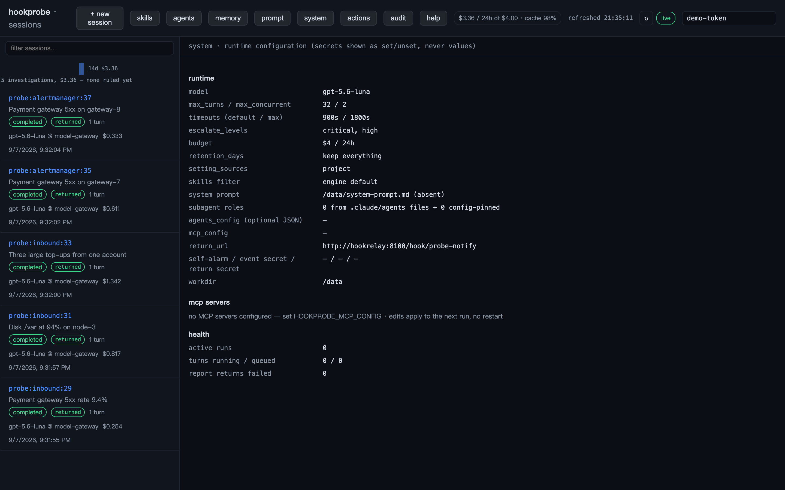

## The hookstack loop: escalation in, report out

The investigator is wired into hookstack's own alert flow: the pipe's
escalation routes copy every front-door event to `/hooks/event`, and whether an
investigation is worth paying for is the probe's own call by level (critical
and high by default, idempotent per source + event_id — a redelivery of the
same event funds one investigation, not N; a restatement carrying a new event
id is a new investigation, which is what the budget breaker is for). When it finishes, the report returns to the pipe's
`probe-notify` front door, signed with hookstack's timestamped HMAC, and the
pipe dresses it as a card for the same channels as the verdict. The pipe stays
content-blind, the judge was not touched at all, and a failed investigation
completes the loop the same way a successful one does.

Since 0.4.0 the demo compose brings the investigator up from the first `up`,
on the `replay` rehearsal — a recorded investigation played back through the
real read-only gate and the real audit, priced at nothing — so the loop below
is visible with no model key, and the smoke check drives it end to end
([the pictures](#the-loop-rehearsed-from-report-to-audit-record)). Setting
`HOOKPROBE_RUNTIME=claude`, `HOOKPROBE_MODEL` and a key makes it real. The run
the screenshots in the sections above come from was the complete loop with a
real model: all four front-door
events were copied to the investigator, the recovery was held back by the
level gate, and the other three each funded an investigation; the judge's
verdicts reached the channels within seconds, and the three reports followed
between 2.3 and 5.6 minutes later through `probe-notify` (ledger #9–#11). The
payment gateway was judged critical with revenue impact; the disk alert was
overturned by evidence as a transient spike. Even the follow-up turn played by
the rules: the round that distilled the skill returned a report of its own
(ledger #12).

"Failure completes the loop" covers every kind of failure, and each was
verified live: timeouts and crashes settle as well-formed failure reports; when
the budget is exhausted a new escalation is **refused but never silent** — a
breaker card stating the reason and the recovery condition still reaches the
channels; even SIGKILL is accounted for, because a run is checkpointed as it
starts and the next boot's sweep settles the orphan into a failure report and
sends it. The loop also runs in reverse: a host crontab that POSTs a "patrol
due" event to the front door turns the escalation door into a proactive
investigation — **patrol mode, zero new code**. Verified: the second patrol
opened the first patrol's case file, compared dimension by dimension and
reported that the verdict agreed, flagging only that disk usage had doubled
while staying inside its threshold.

That comparing-against-last-time is what turns patrol mode from a scheduled
health check into hookstack's answer to two questions no single alert can
answer. Both ship as briefs and crontab lines in
[`hookprobe/examples/patrols/`](hookprobe/examples/patrols/README.md), and
both are prompts rather than code: **"is the noise going up or down"** reads
the judge's attention block over seven days (`/status?window_hours=168` — the
window was already a query parameter), opens last week's edition of itself and
reports the direction of cards-per-condition against what it cost;
**"propose a scheduled silence"** looks for the condition that fires in
the same hour every night and that a human ruled not worth it, and proposes
quieting it. Proposing, not doing — hookstack's established shape, the same
one memory suggestions and remediation already take.

The briefs are written to be honest about what they cannot see, which is the
part that makes them worth trusting: `mattered_pct` is null until a human
presses a button, and on a channel with no interactive callbacks nobody can,
so the weekly brief forbids reading missing rulings as "nobody cared" and
answers the volume question — which needs no rulings — instead. The silence
brief has a harder limit to state: a silence in hookrelay matches a **source**,
not a condition, and nothing anywhere takes a recurring schedule, so the
proposal names which of three real options it means and never describes a
fourth that does not exist. Why these are patrols and not a reporting layer in
the smallest brain is on file in
[`.agents/notes/implemented/`](.agents/notes/implemented/2026-08-20-a-trend-report-is-a-patrol-not-a-feature.md).

## The loop, rehearsed: from report to audit record

Four pictures of one loop, taken on 2026-09-30 against the source compose
with no model key: three from one `demo.sh` run, the pipe's from the stack
smoke, which runs the same loop and left the board's other states on screen
too. Every number in the report was written in advance and its last
section says so; everything else in the pictures happened: the gate refused a
recorded call, a press went through the pipe's door with a person's name on
it, two commands ran as argv, the alert resolved, and the ledger kept it all.

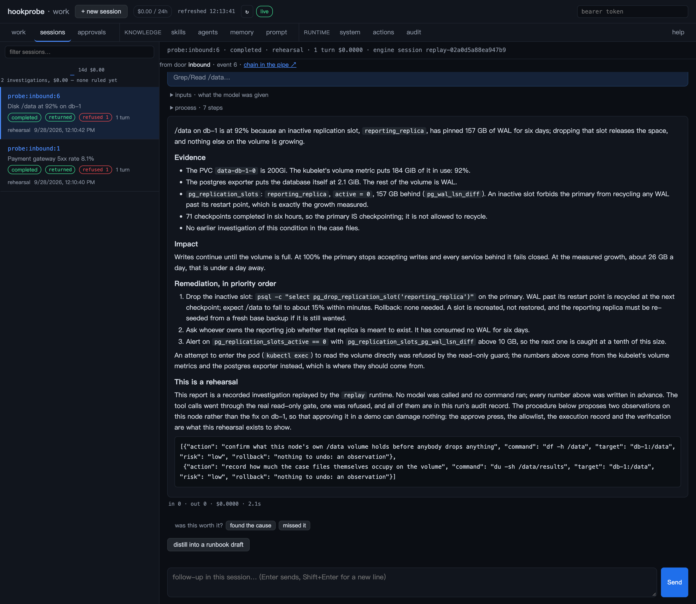

The report the card was written from, on the investigator's own page. The
row says `refused 1`: the recorded `kubectl exec` into the database pod met
the real read-only guard, and the refusal is in this run's audit. The run cost
nothing — `in 0 · out 0 · $0.0000` — and the procedure at the end proposes two
observations rather than the fix, so approving it in a demo can damage nothing.

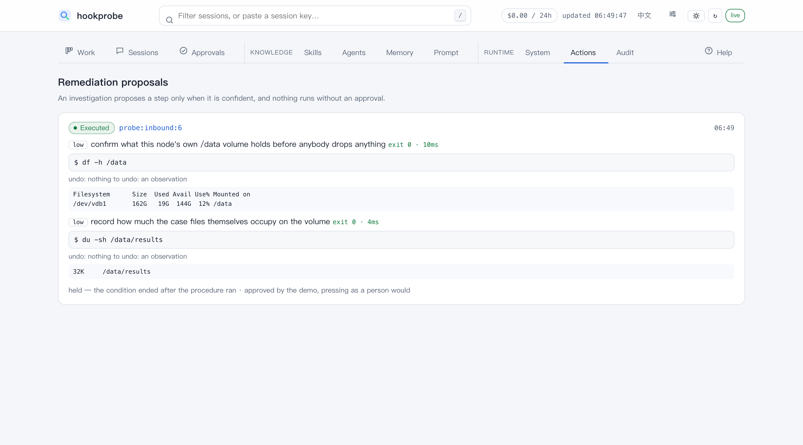

What the approve press did. Both steps ran as argv with their exit code and
output beside them, and the line under them is the part that did not exist
before 0.4.0: **held — the condition ended after the procedure ran**, and
**approved by** the actor the press carried. Exit 0 alone verifies nothing
here; the recovery that arrived afterwards is the witness.

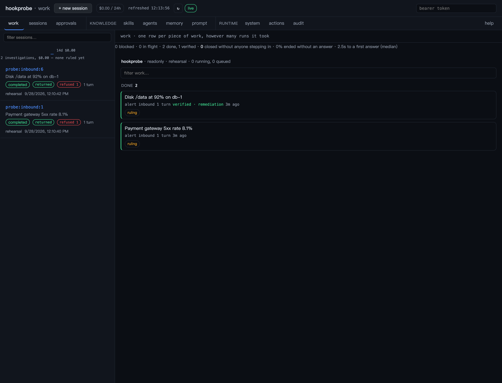

One card per piece of work. The disk investigation is `verified · remediation`;
the header's strict number reads `0 closed without anyone stepping in`, because
a person approved the procedure — a request is not an intervention, but an
approval is, and the board says so rather than flattering itself.

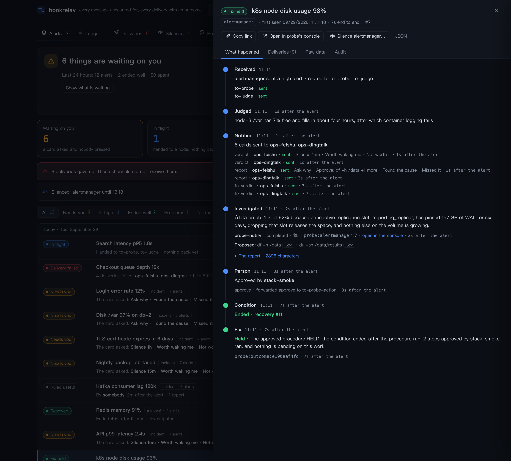

The same operation from the pipe's side, as the story its row opens into:
received, judged, notified — six cards, each named by the message it carried
and what it asked — investigated, **a person** — the approve with the actor who
made it — then the condition ending and, last, the fix **held**, told by the
investigator through the same door its report took.
This is the record pilot zero never had: on the retired production deployment
no card ever carried the button, so this line was never written.

## Running it locally

The whole stack is self-contained (the stub model, the rehearsal and the sink
all live in the repository), so one command starts all of hookstack, the
investigator included: it comes up on the rehearsal, which costs nothing, and a
model key makes it real. Each service's gate is an exact local replica of its
CI job — gate before pushing, CI confirms after, and that is the fixed
discipline of this repository.

```bash
# the whole stack: pipe, judge on the stub model, investigator on the rehearsal, sink
git clone https://github.com/itswl/hookstack && cd hookstack
docker compose up -d --build      # relay :8100 · judge :8200 · probe :8088
bash scripts/demo.sh              # the loop end to end, for $0
bash scripts/stack-smoke.sh       # or the whole smoke check
```

```bash
# make the investigator real (any Anthropic-dialect endpoint works:
# ANTHROPIC_BASE_URL + ANTHROPIC_AUTH_TOKEN instead of the key)
printf 'HOOKPROBE_RUNTIME=claude\nHOOKPROBE_MODEL=claude-opus-5\nANTHROPIC_API_KEY=sk-ant-...\n' >> .env
docker compose up -d --build
open http://127.0.0.1:8088/ui
```

Beyond the demo, the deployment layout is uniform:
`<service>/deploy/docker-compose.yml` runs any one service standalone, and
`deploy/docker-compose.yml` at the repository root runs all three with real
credentials (no stub, no sink; the pipe's config and every secret come from
the deployment root's .env). Both are invoked from the repository root with
`docker compose --env-file .env -f <file> up -d --build`. The
`docker-compose.prod.yml` files under `hookrelay/deploy/` and
`hookprobe/deploy/` are the production shapes, joined to the docker network of
the platform they serve.

## The loops that tighten

The three services carry four feedback loops, and the loops — not the feature
list — are what the stack is *for*. Each conserves something scarce, and each
records enough to be argued with:

**Attention.** The judge answers a second question beside importance: does a
person need to act *now*? The pipe drops the card on an explicit "no" — every
dropped card stays on the boards and in both ledgers, an unanswered verdict
always fails open into a card, and a regret counter tracks the only failure
that matters: a quieted interruption a person later ruled worth having.

**Money, per verdict.** One paid judgement answers a storm of restatements of
the same condition; recoveries inherit their firing's verdict instead of
buying a contradiction.

**Money, per investigation.** Finished investigations distil runbooks; piles
of cases consolidate into one procedure; a condition with a standing
*not-worth-it* ruling answers its re-fires from that runbook at no cost — and
still earns a real investigation on a schedule, because a ruling nobody
re-checks is a prejudice with a timestamp. A re-fire a few hours after a real
investigation, at the same level with no recovery between, is answered from
that investigation instead of bought again, because on the deployment this was
measured on the ruling arrives days after the money is spent.

**Judgement quality itself.** A golden set of labelled production incidents
replays through the judge's prompt on every deploy, and a prompt that
under-calls a golden — or quiets what the label says must wake someone —
does not ship. Its first live day caught the judge obeying an instruction
embedded in an alert.

Where a loop needs a human who never comes, patrols infer the answer and file
it *marked as inferred* — the worth accounting says in words when its numbers
are a model's opinion of a model.

## Where this stands

All of it ran unattended on a production alert stream from August until
2026-09-23: signatures on the outward doors, budgets and escalation tuned
against the real noise floor, reports returning as cards a person could rule on
from chat, remediation parked behind approval and an allowlist, and the whole
deployment reproducible from this repository plus one `.env`. That deployment
was retired on 2026-09-23 at the operator's decision; its host now runs only the
alerting platform it sat behind, and `deploy/shadow.yaml` with its compose stays
here as the worked example of the alert shape. What runs today is the work
deployment, on the operator's own machine. The numbers above were read from
live boards while it ran; the loops are young, and the honest posture is the
one the ledgers enforce — every claim of savings has a counter somebody can
check.

## Where this sits in an AI-native SDLC

Anthropic's [AI-native SDLC playbook](https://claude.com/blog/the-ai-native-sdlc-playbook)
names the stage hookstack is built for — **Maintain**: cheap deterministic
answers before a model is paid, an investigator only for the alerts that
earned one, remediation proposed rather than applied, every decision in a
ledger a person can audit later. That posture is enforced here rather than
described: the verdict routes are ordered so most events never reach a paid
call, the write-gates are tested, and a prompt change that under-calls a
golden incident does not deploy.

[How Anthropic secures its own AI-native SDLC](https://claude.com/blog/how-anthropic-secures-its-ai-native-software-development-lifecycle)
treats agents as monitored actors rather than trusted authors. Same side
taken here, for the same reason: the investigator runs read-only by default
and proves it at startup, cannot edit
what steers its next run, its runbooks are written by the service and never
through its own tools — and a red-team run drives injections at the memory
path against a live model before an operator is asked to trust it.
