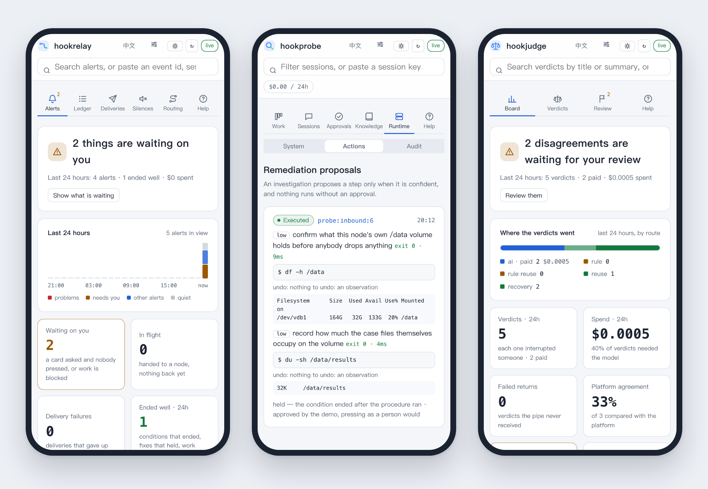

# hookstack

[](https://github.com/itswl/hookstack/actions/workflows/ci.yml)
[](https://github.com/itswl/hookstack/actions/workflows/ci-hookjudge.yml)
[](https://github.com/itswl/hookstack/actions/workflows/ci-hookprobe.yml)

**English** · [中文](README.zh-CN.md)

**Put agents on your production signals without handing them the keys.**

A signal comes in: an alert, a chat message, a ticket, a timer. A pipe signs, routes and prices it. An agent investigates it read-only, and proves it is read-only at startup. The report reaches a person as a card they can rule on. Nothing touches production without a signed press.

| service | what it does |
| --- | --- |
| [`hookrelay`](hookrelay) | **The pipe.** Adapts any webhook, routes it, delivers to chat, and keeps one ledger of every hop. |
| [`hookjudge`](hookjudge) | **The judge.** Decides cheaply whether a person must act now. Most events never pay for a model. |
| [`hookprobe`](hookprobe) | **The investigator.** One read-only agent run per event, behind an OpenClaw-compatible HTTP contract. It also runs on its own. |

The investigator is the product. The pipe and the judge are the smallest alerting front end for a team that has none. One deployment is one team: this is not a work-management platform, a multi-tenant SaaS or an agent framework.


## Try it: ten minutes, no keys, no bill

```bash
curl -fsSLO https://raw.githubusercontent.com/itswl/hookstack/main/docker-compose.quickstart.yml
docker compose -f docker-compose.quickstart.yml up -d   # pipe + judge + stub model + investigator on a rehearsal + readable sink
bash <(curl -fsSL https://raw.githubusercontent.com/itswl/hookstack/main/scripts/demo.sh)
```

The demo runs the whole loop. An alert is judged, a recorded investigation replays through the real read-only gate, the report arrives as a card, an approve press runs two allowlisted commands, and the alert resolves. To use a real model, put `HOOKPROBE_RUNTIME=claude`, `HOOKPROBE_MODEL` and a key in `.env`.

## What you get

- **Only the work worth doing.** A storm, a restatement or a recovery never buys a second verdict. On 795 production alerts, 28 of 29 rules answered the same every time, so `rule-reuse` answers them for free.
- **A card a person can rule on.** Every button is signed before the card leaves, and every press is recorded.
- **Remediation with a person in the loop.** An approved procedure runs step by step against an allowlist, as argv, never through a shell. A press approves the version that was read: the card and the console both name the procedure's digest, and one that changed since is refused. A plan a person hands off is carried out by a separate work node, with a write credential of its own and a guard that refuses destructive commands; it made its first real change on 2026-09-30 ([how it went](docs/deployments.md#the-first-real-write)).
- **Investigations that leave something behind.** A finished run distills a runbook, and the next occurrence starts from it.
- **Agents you can contain.** Read-only by default and measured at startup, budget ceilings that refuse out loud, and the structural boundaries, each written up with what it does **not** stop ([containment](docs/containment.md)).
- **Boards that install on your phone.** All three boards are web apps you add to the home screen, the investigator's under its node's own name; each keeps its tokens in that browser and nothing else, and offline it shows the page and says its service is out of reach. On a phone the header runs under the status bar in its own colour and follows the theme, the tabs fit one row, and wide tables become one block per row.
- **One audit page per event.** Every hop, digest, decision and human action, a flight recorder of every tool call, and a timing waterfall per run.
- **Your model, your chat.** Any Anthropic-dialect endpoint for the investigator, any OpenAI-compatible one for the judge, local models included. Feishu/Lark through a bridge ([protocol](docs/bridge-protocol.md)), DingTalk and WeCom as a plugin, or signed JSON to any webhook.




The three boards read in Chinese or English and follow the system's light or dark. The screenshots come from local runs, not mockups.

## How it fits together

```
upstreams ──► hookrelay ──► hookjudge ──► hookrelay ──► chat bridge / webhook
                  │
                  └──► hookprobe ──► hookrelay ──► the same channels
                       (critical/high; a rehearsal until it has a model)
```

The same pipe also carries an operator's own work signals to a planner and, on a person's press, to a work runner ([two deployment shapes, one codebase](docs/deployments.md)).

## Read more

- [OVERVIEW.md](OVERVIEW.md): the tour, with every screenshot
- [STACK.md](STACK.md): run the whole stack locally, step by step
- [hookrelay](hookrelay/README.md), [hookjudge](hookjudge/README.md), [hookprobe](hookprobe/README.md): each service in depth
- [docs/containment.md](docs/containment.md): the security boundaries
- [docs/bridge-protocol.md](docs/bridge-protocol.md): how a card reaches a chat platform
- [CONTRIBUTING.md](CONTRIBUTING.md): gates and workflow

## Developing

`bash scripts/gate.sh` runs every service's gate plus the stack checks. Read its verdict before you commit. The pipe caps itself at 6,050 source lines and the judge at 3,400; the investigator is uncapped.

MIT licensed.
