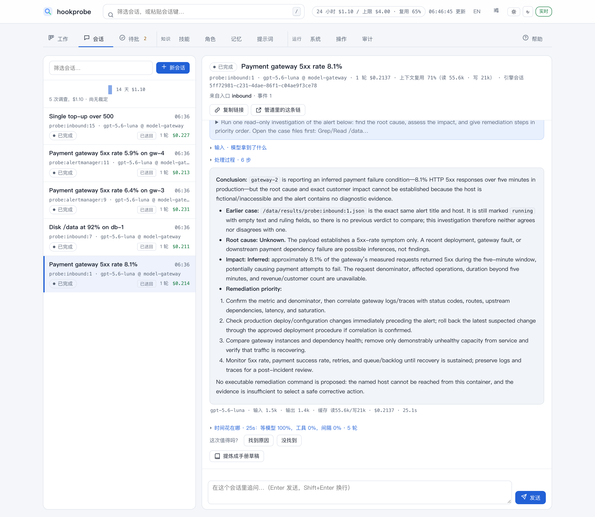
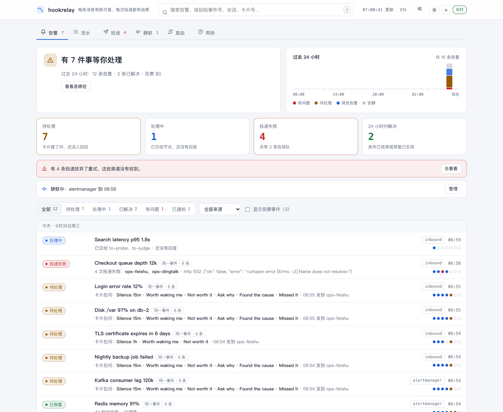
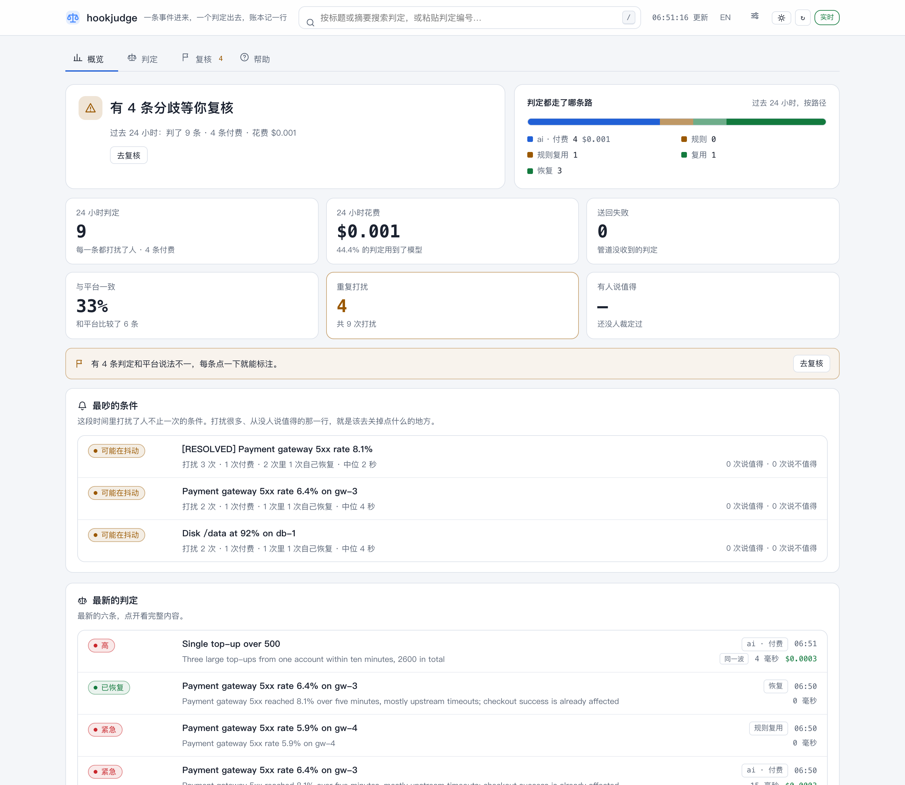
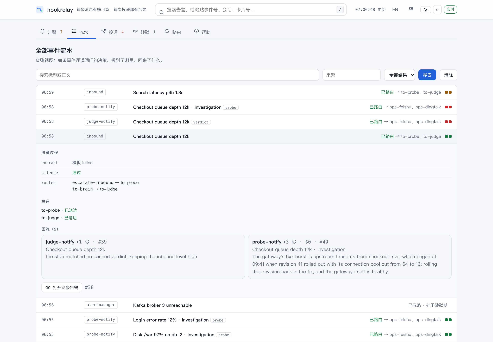

[English](../) · **中文**

**让 agent 值班，但不把钥匙交出去。**

一条信号进来：告警、聊天消息、工单、定时任务。管道给它签名、路由、计价。agent 只读地调查它，并在启动时证明自己是只读的。报告作为一张卡片到人手里，人可以直接裁定。没有一次签名的按下，什么都碰不到生产。

| 服务 | 做什么 |
| --- | --- |
| `hookrelay` | **管道。** 接任意 webhook，路由，投递到聊天，每一跳都记进同一本账。 |
| `hookjudge` | **判官。** 便宜地判断是否需要有人马上处理。大多数事件用不着调模型。 |
| `hookprobe` | **调查员。** 每个事件跑一次只读的 agent 调查，对外是 OpenClaw 兼容的 HTTP 契约。也能单独使用。 |

调查员是产品本身，管道和判官是给没有告警平台的团队准备的最小前端。一套部署就是一个团队：它不是工作管理平台，不是多租户 SaaS，也不是 agent 框架。



## 试一下：十分钟，不要 key，不花钱

```bash
curl -fsSLO https://raw.githubusercontent.com/itswl/hookstack/main/docker-compose.quickstart.yml
docker compose -f docker-compose.quickstart.yml up -d   # 管道 + 判官 + 桩模型 + 跑排练的调查员 + 可读的接收端
bash <(curl -fsSL https://raw.githubusercontent.com/itswl/hookstack/main/scripts/demo.sh)
```

演示会跑完整条闭环：告警被判定，一次录好的调查经过真实的只读门回放，报告变成卡片，按下批准后跑两条允许清单里的命令，告警恢复。要换成真实模型，在 `.env` 里设置 `HOOKPROBE_RUNTIME=claude`、`HOOKPROBE_MODEL` 和模型 key。

## 你能得到什么

- **只做值得做的事。** 告警风暴、重复的同一条件、恢复事件都不会再花第二次判定的钱。在 795 条生产告警上实测，29 条规则里有 28 条每次答案都一样，所以 `rule-reuse` 不调模型就能回答。
- **一张人可以裁定的卡片。** 每个按钮在卡片发出前就签了名，每次按下都有记录。
- **修复有人把关。** 批准后的流程逐步对照允许清单执行，以 argv 运行，从不经过 shell。人交接的计划由单独的执行节点用它自己的写凭证去做，危险命令会被拒绝；2026-09-30 它第一次真实改动了系统（[经过](../deployments.md#the-first-real-write)）。
- **调查会留下东西。** 跑完的调查会提炼成手册，同一条件下次出现时从手册开始。
- **关得住的 agent。** 默认只读并在启动时实测，预算用完会明确拒绝，另有二十九条结构性边界，每一条都写明它**挡不住**什么（[containment](../containment.md)）。
- **装到手机上的看板。** 管道的看板是个可以添加到主屏幕的 web 应用；口令只留在那个浏览器里，离线时显示页面并告诉你连不上管道。
- **每个事件一页审计。** 每一跳、摘要、决策和人的操作，每次工具调用的飞行记录，以及每次运行的耗时瀑布图。
- **模型和聊天工具由你选。** 调查员接任意 Anthropic 方言的端点，判官接任意 OpenAI 兼容的端点，本地模型也可以。飞书经桥接送达（[协议](../bridge-protocol.md)），钉钉和企微有插件，也可以把签名 JSON 发到任意 webhook。







三块看板都能切换中英文，并跟随系统的浅色或深色。截图取自本地真实运行，不是效果图。

## 怎么串起来

```
上游 ──► hookrelay ──► hookjudge ──► hookrelay ──► 聊天桥 / webhook
             │
             └──► hookprobe ──► hookrelay ──► 同样的通道
                  （critical/high；没有模型时跑排练）
```

同一条管道也搬运操作者自己的工作信号，交给规划器，再经人按下交接后由执行节点去做（[两种部署形状，一份代码](../deployments.md)）。

## 继续读

*   [完整的叙述性总览（OVERVIEW.md）](https://github.com/itswl/hookstack/blob/main/OVERVIEW.md)（英文）
*   [hookprobe 参考文档](https://github.com/itswl/hookstack/blob/main/hookprobe/README.md)（英文）
*   [把三件套一起跑起来（STACK.md）](https://github.com/itswl/hookstack/blob/main/STACK.md)（英文）
*   [安全边界（containment）](../containment.md)（英文）
*   [WebhookWise](https://itswl.github.io/WebhookWise/zh/) —— 这几个服务生长出来的那个自托管告警平台

MIT 协议。
