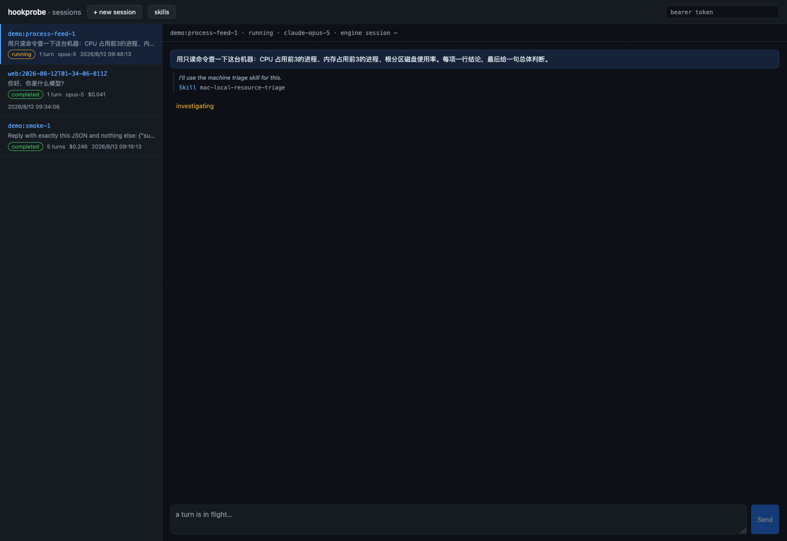

[English](../) · **中文**

**把 AI Agent 放进生产，并且事后算得清账（具备财务可审计性与结构化安全围栏）。**

形状总是同一个：**某个东西产出信号，一条管道搬运它并且为每一跳记账，专职节点做判断或做调查，活下来的那些抵达一个人。** 三个各做一件事的服务填进这个形状 —— 内容无关的管道、判官、只读调查器 —— 完全用配置文件而不是代码连起来。

让它不止是一个路由器的，是每次交接周围的东西：每一跳都密码学签名、重试、指数退避调度、可回放，每个 agent 都跑在一份凭证、一个预算上限、和一张写死了"它能做什么"的闭集清单后面。

**告警是它被磨出来的那个实例**，下面大部分例子说的也是那口方言。但告警不是这个形状本身 —— 这个仓库里的第二套部署搬的是操作者自己的工作信号（聊天和工单，经过一个盯守器和一个规划器，进两个不同的群），**和第一套共享每一行代码**（[docs/deployments.md](../deployments.md)）。你的信号如果来自完全别的地方，管道是设计上内容无关的，它不会注意到区别。

那个 [agent runner](#hookprobe) 本身就有用，无论你关不关心告警。

MIT 协议，`docker compose up`。→ **[github.com/itswl/hookstack](https://github.com/itswl/hookstack)**

---

## hookprobe：一次 Agent 运行，包在一个 HTTP 契约里 {#hookprobe}

你 POST 一个任务。hookprobe 跑一次带工具的 agent 会话（Claude Agent SDK：bash、MCP 服务器、联网搜索、`SKILL.md` 技能），然后把报告交给来轮询的人。没有消息通道，没有设备配对，没有聊天历史。

它说的是 OpenClaw 兼容的方言 —— 已经把那个 gateway 当分析后端的客户端，改个 URL 就能切过来。

```bash
git clone https://github.com/itswl/hookstack && cd hookstack
printf 'HOOKPROBE_TOKEN=change-me\nANTHROPIC_API_KEY=sk-ant-...\n' > .env
docker compose --env-file .env -f hookprobe/deploy/docker-compose.yml up -d --build

curl -s -X POST localhost:8088/hooks/agent \
  -H "Authorization: Bearer change-me" -H 'Content-Type: application/json' \
  -d '{"message":"哪些进程在监听，分别监听什么端口?","sessionKey":"demo:1"}'

curl -s -H "Authorization: Bearer change-me" localhost:8088/sessions/demo:1/final
```

### 三个不一样的地方

**它会终止。** `/final` 只返回 `202`，或者一个确定终态的 `200` —— 包括运行崩溃或超时的情况，那时报告的 `root_cause` 会写明是 runner 挂了。调用方第一次读到确认就能落库，不用自己发明「连续三次答案没变就算完了」这种稳定性启发式。

**Agent 改不了那些会左右下一次运行的东西。** `.claude/`（技能、角色、设置）、`CLAUDE.md` 和审计日志对它是关闭的 —— 由一个 PreToolUse hook 直接拒绝写入，再加上每次运行前后比对所有输入文件的哈希摘要，因为这两者的失效方式不一样。没有这道防线，一条注入进 `.claude/skills/` 的指令就活过了读到它的那次运行，以后会以「运维自己的 runbook」的身份回来。

**跑完的运行会留下 runbook。** 一次完成的调查会把自己的记录蒸馏成 `SKILL.md` —— 由服务写入，永远不经过 agent 的工具。同一个条件的第二次调查是**追加一个 case** 而不是替换原有内容，而且每一次写入（无论来自运行还是来自人）都会先把被覆盖的版本快照存档。





---

## 把 Agent 放在会花钱的地方

这里的 agent 被当作一个**不可信的网络服务**：它花钱、它读别人写的文字、它握着凭证。下面每一条的存在，都是因为这三件里至少有一件是真的。

| 安全控制层 | 核心技术控制 |
| --- | --- |
| **交接带签名** | 每道门校验带时间戳的 HMAC；每个节点有自己的密钥、预算和守卫 |
| **能做什么是一张闭集清单** | `HOOKPROBE_MCP_TOOLS` 列出这个实例可以调用的 MCP 工具，**留空则一个都不许调**。挂载一个 server 不等于授予它的工具 —— 没有哪个 server 因为你希望它只读就真的只读，一个聊天 server 会把 `send_message` 和 `search_messages` 放在一起 |
| **能得出什么结论也是闭集** | 一个能左右路由的裁决，只能从操作者声明过的词表里挑，不能自由书写 |
| **只读是构造出来的** | 写操作动词在执行前被拒（`aws` 命令**除非是读否则拒绝**）、只读凭证才是真正的边界、还有一个安全钩子拦住 "一次运行改写自己下一次的指令" |
| **花销有硬性上限** | 窗口内花超了就拒绝新的自主运行，而且**每次拒绝都自己报出来**，不会静默 |
| **改路由之前先看清图** | `GET /topology` 只凭配置渲染出门、阶段落点、出口，并点出这个形状隐含的风险：没有路由能到的门、没有东西喂的出口、以及会把 brain 自己的输出喂回给它的回环 |
| **事后能翻旧账** | `GET /trace/{id}` 回放每一跳的双向字节 —— 只存 body 从不存 headers，因为 headers 带签名和令牌 |

诚实的完整版本，**包括每条边界挡不住什么**，在 [docs/containment.md](https://github.com/itswl/hookstack/blob/main/docs/containment.md)。一条只被 "它能挡住什么" 描述过的守卫，会被拿去信任它从未声称过的事情。

### 同一份代码，两张完全不同的图

这个仓库跑着两套部署，共享每一行服务代码。一套把监控平台的告警穿过三个判官送成一张卡片；另一套把操作者自己的工作信号 —— 聊天和工单 —— 穿过一个盯守器送到两个不同的群，并且在 "确实是活儿" 那条分支上挂一个规划器。**两边都没有多写一行 Python**，而它们分歧的四个地方各有各的理由：[docs/deployments.md](https://github.com/itswl/hookstack/blob/main/docs/deployments.md)。

---

## 产品演进蓝图与高级模式

1.  **提案型自愈（Remediation Loops）：** 从“只读诊断”走向“提案自愈”。Agent 排查故障后，自动生成修复脚本并以 Feishu 卡片形式呈现。卡片上附带 `action_secret` 加密签名的 `[批准执行]` 按钮，必须经人类确认并调用该合法签名，安全自愈 Runner 才会执行相应动作，完美兼顾速度与安全。
2.  **SRE 专属的 RLHF（自我进化）：** 捕获人类在卡片上点击“其实不重要”、“确认恢复”的反馈，自动转换为标准 JSONL 数据集。该数据集自动输入本地模型 SFT 循环或 Prompt 微调，让大脑随使用时间的增加而越来越懂企业的业务。
3.  **本地轻量级模型（vLLM/Ollama）集成：** 支持 Qwen/Llama 等 7B/8B 量级本地模型接入。在此类特定分类任务上，微调后的本地小模型可提供“零 API 成本、完全离线、低时延”的顶级大脑。
4.  **影子对比审计视图（Shadow Brain Audit）：** 支持多个 Prompt 版本或模型分支并行评测，并在 Web 控制台上进行可视化分歧度对比审计，在无生产风险前提下测试最佳决策质量。

---

## 完整的三件套

| 组件 | 职责 | 刻意不做 |
| --- | --- | --- |
| **hookrelay** | 管道 —— 把每种上游方言适配进来、每种通道格式渲染出去，并且全程记账 | 理解内容，或做判断 |
| **hookjudge** | 判官 —— 一个事件进,一个判定出,五条按成本排序的路径 | 渲染卡片,或了解通道 |
| **hookprobe** | 调查员 —— 对值得的事件跑一次只读 agent 运行：告警问「哪里坏了」,工作项问「具体怎么做」 | 接收告警,或发送通知 |

```
上游告警源（Grafana / Alertmanager / 云监控 …）
      │
      ▼
  hookrelay :8100 ──► hookjudge :8200 ──► hookrelay ──► 飞书 / 钉钉 / 企微
  （管道:适配+路由+账本） │ （判官:判定+成本）     （格式化并投递）
                          │
                          └──► hookprobe :8088 ──► hookrelay ──► 同样的通道
                               （调查员:只读）      /hook/probe-notify

已经自己判过的源走终端路由，不再进判官：

  你的源 ──► hookrelay ──┬──► 你指定的通道   （不判:它已经定了）
  （签名的门）            └──► hookprobe :8088 （它说要查才查）
```


上面每一张截图都取自一次从零开始的本地 Docker 运行 —— 不是效果图。

---

## 每个组件是怎么工作的

同一个形状 —— **管道、决策脑、调查员** —— 每个组件只做一件事。这里写的是每一个里面有什么、以及为什么。

### hookrelay —— 管道

- **输入适配器。** 按来源的声明式配置，从任意上游载荷（Alertmanager、Grafana、裸 webhook）里抽出 `title`、`body`、`level` 和字段，并把告警等级归一化 —— 下游没有任何东西需要学厂商的方言。
- **每道门一根风暴熔丝。** 按来源做两段式的流量保护：超过阈值，事件仍然**被记录**（`skipped · storm_suppressed`，计数写进它的 trace），但不走流水线、不到达任何通道或付费决策脑；超过 10 倍阈值，直接 429 拒绝、不碰存储 —— 这个量级上要保护的正是账本本身。刻意做成进程内的：熔丝负责保护，账本负责记账。
- **每个通道一个熔断器。** 当一个通道整体不可用（飞书连不上、bot 被吊销），熔断器在连续失败后打开，把该通道的每次投递**延迟**而不是让它们各自把重试预算撞墙耗尽；冷却期过后恰好放一次探测投递，成功则闭合、失败则重新打开。
- **围着速率限制设计的投递 worker。** 通道**之间**并行 —— 一个挂起的端点不能队头阻塞其它通道；同一通道**之内**串行 —— 每分钟限速计数的是真正发出去的数量。失败从 30 秒起退避、逐次翻倍、封顶 600 秒，然后进死信 —— 账本写明原因。
- **卡片按钮带签名。** 按钮携带的回调载荷在卡片发出前就用 `action_secret` 做 HMAC 签名；一次按压只有签名校验通过才会被门接受，网络上任何东西都伪造不了一个人的点击。

### hookjudge —— 决策脑

它只回答一个问题 —— **这个人现在需要马上处理吗？** —— 对卡片和通道一无所知。五条路由按成本顺序尝试，而这个顺序**就是**成本策略：

| 路由 | 成本 | 何时 |
| --- | --- | --- |
| `recovery` | 免费 | 条件已结束：直接继承它触发时的判定，永不重新分析过去 |
| `reuse` | 免费 | 同一告警特征在时间窗内已判过 —— 告警风暴是同一个条件的反复重述 |
| `rule-reuse` | 免费 | 同一条告警**规则**上一次的 AI 判定再答一次（实测：29 条规则里 28 条每次答案完全相同） |
| `ai` | 付费 | 模型读它，在一份带版本号、必须返回严格 JSON 的 prompt 之下 |
| `rule` | 免费 | 模型不可用、超预算或答得不可用：中英双语关键字规则兜底，并且判定里用 `degraded_reason` **明说** —— 藏起来的降级比缺失的判定更糟 |

当模型失败的原因是人必须去修的（key 失效、余额耗尽、硬配额），判官发一次限流的报警，而不是悄悄用关键字判完每一条、直到有人去读账本。

### hookprobe —— 调查员

当判定值得（critical/high），管道把事件复制一份交给 hookprobe，它在 Claude Agent SDK 上跑**一次只读的 agent 会话**（bash、MCP 服务器、`SKILL.md` 技能），把报告交给来轮询的人 —— 一份 OpenClaw 兼容的契约，已经指向那个 gateway 的客户端改个 URL 就能切过来。只读是**构造出来的**，三层、各自的失效方式不同：

1. **凭证才是真正的边界。** 挂进容器的 kubeconfig 和云 key 都是只读主体。就算其它每一层都失效，集群和云本身仍然会拒绝。
2. **Bash 守卫在执行前拒绝写操作动词。** 一个 PreToolUse 钩子拒绝 `kubectl delete/apply`、`helm` 变更、`systemctl` 写入及其同类。对 `aws` 这种大到无法列黑名单的 CLI，清单是**反向**的：不在已知读动词（`describe`、`get`、`list`……）之列的一律拒绝 —— 一个新出的写操作 API 不能因为"新"就溜进来。
3. **输入表面做指纹校验。** 告警正文可能携带间接注入，指使 agent 去改 `.claude/`、某个 skill 或 `CLAUDE.md`，让指令活过这一次运行。每个会左右下次运行的文件在运行前后都做哈希；任何不是操作者做出的改动都作为 `input_changes` 上报 —— 而钩子本来就会拒绝那次写入。两套机制，因为它们的失效方式不同。

### lark-bridge —— 管道拒绝长成的那个边车

自建 bot 只能**发**，它卡片上的按钮无处回调。bridge 就是为这条回程而存在的：它向飞书**主动拨出**一条长连接来接收按钮按压，再把每一次按压转给 hookrelay 的签名卡片动作门。因为连接是出方向的，告警网络不需要开任何入站端口 —— hookrelay 的公网前门是刻意关掉的，这里也不会把它重新打开。做成边车而不是管道插件，是因为 IM 平台的鉴权、token 刷新和 websocket 方言不属于管道的四根柱子里的任何一根，而管道给自己的体积设了上限。

---

## 继续读

*   [完整的叙述性总览（OVERVIEW.md）](https://github.com/itswl/hookstack/blob/main/OVERVIEW.md)（英文）
*   [hookprobe 参考文档](https://github.com/itswl/hookstack/blob/main/hookprobe/README.md)（英文）
*   [把三件套一起跑起来（STACK.md）](https://github.com/itswl/hookstack/blob/main/STACK.md)（英文）
*   [WebhookWise](https://itswl.github.io/WebhookWise/zh/) —— 这几个服务生长出来的那个自托管告警平台
